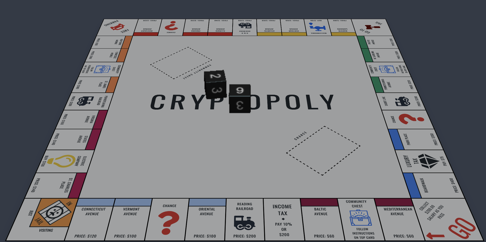

# Cryptopoly: Decentralized Monopoly POC using Ethereum Statechannels

This is the official code implementation accompanying my honors thesis [*Cryptopoly: Using Ethereum State Channels for Decentralized Game Applications*](/public/Cryptopoly.pdf) for Barrett, The Honors College.

Play the game here: https://monopoly.vercel.app

Note: You will need Metamask installed with the Goerli test chain initialized.

## Using this Project

Clone this repository, then install the dependencies with `yarn install`. 

## Available Functionality

### Build Contracts

`yarn build:contracts`

### Run Web Server

`yarn serve`

PRs and feedback welcome!
